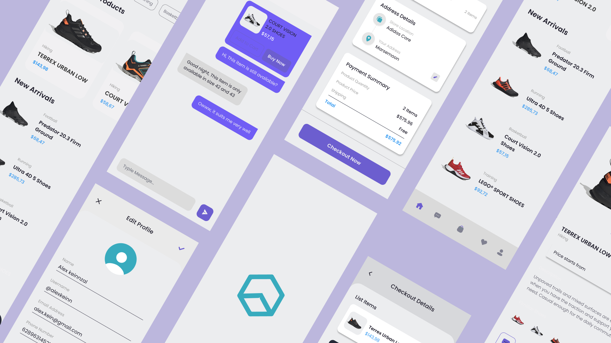

# Flutter Music Player UI

```dart
class Revaldo extends FlutterProject {
    return {
      "title": "Flutter E-Commerce with Laravel Back-End",
      "description": "Make an E-Commerce application that uses Flutter Technology and Laravel for API",
    }
}
```

## Getting Started 🚀

```shell
- Clone the repo
- flutter pub get
- flutter run
```

## ScreenShot

